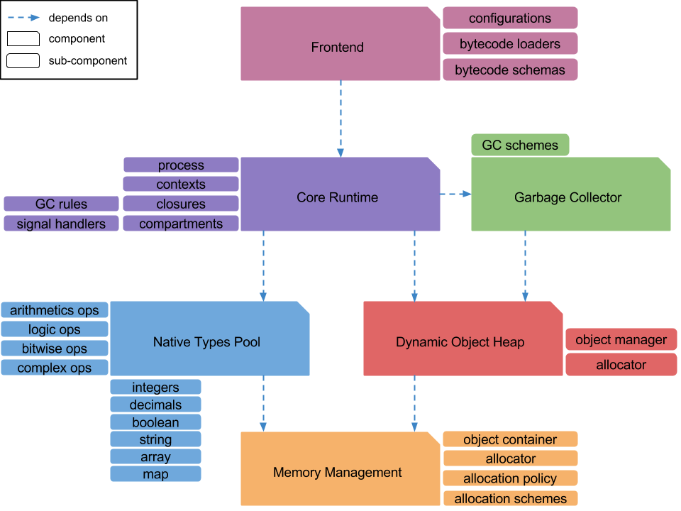

.. Copyright Yanzheng Li. All rights reserved.

Design and Architecture
=======================

coreVM's architecture can be generalized into 7 components:

  * :ref:`memory-management`
  * :ref:`native-types-system`
  * :ref:`object-management`
  * :ref:`garbage-collection`
  * :ref:`core-runtime`
  * :ref:`jit-pipeline`
  * :ref:`front-end`

Here's an illustration of the high level architecture:

.. _memory-management:

Memory Management
-----------------

The foundation of coreVM is the memory management component, which comprises an
allocator interface that can be customized to make use of a variety of
allocation schemes. The allocator interface provides the functionality to
allocate and deallocate memories for other components in the system, including
:ref:`object-management` and the :ref:`native-types-system`.

.. _native-types-system:

Native Types System
-------------------

The native types system is an independent component that defines a set of
primitive types, as well as all the operators that are used to perform
computations on them, such as arithmetic, bitwise, logic, and complex type
operations, etc. The native types system provides a set of types and interfaces
for native types and their operations so that language developers do not have to
implement their own. There are currently 14 native types defined:

  * 8-bit signed integer
  * 8-bit unsigned integer
  * 16-bit signed integer
  * 16-bit unsigned integer
  * 32-bit signed integer
  * 32-bit unsigned integer
  * 64-bit signed integer
  * 64-bit unsigned integer
  * single-precision floating point decimal
  * double-precision floating point decimal
  * boolean
  * string
  * array
  * map

.. _object-management:

Object Management
-----------------

One component that directly relates to the :ref:`memory-management` layer is the
object management layer. At its core, it is consisted of a heap that manages 
objects from memories allocated from the memory layer. Objects in coreVM are
referred as *dynamic objects*, as their properties can be changed dynamically,
and coreVM does not specify any object model by default. This design provides
the flexibility for language developers to incorporate custom object
abstractions and meta-programming features.

Dynamic object can also reference native types. For example, one may implement
boxed integers in a programming language as dynamic objects that each holds an
instance of native type value of type 32-bit signed integer, in order to perform
integer arithmetic operations.

.. _garbage-collection:

Garbage Collection
------------------

The garbage collection layer is responsible for cleaning up unreachable objects
stored on the heap. The garbage collector is designed to be configured to use
one of several types of garbage collection schemes, including the currently
supported “reference counting” scheme. The current version of the garbage
collector has a non-copying, non-generational, and stop-the-world
implementation. Future works to improve and optimize GC performance are on the
roadmap.

.. _core-runtime:

Core Runtime
------------

The core runtime layer is the central component that interacts with the rest of
the components in order to execute coreVM bytecode. The core of the component is
a process abstraction that manages the executions of bytecode, as well as
responsible for managing a variety of operations such as thread management,
signal handling, garbage collection, and many more.

.. _jit-pipeline:

JIT Pipeline
------------

The just-in-time compilation pipeline is a separate process that compiles
code represented in `coreVM Intermediate Representation <ir_reference.html>`_
to machine code. The pipeline's front-end is responsible for loading IR
bytecode, its middle-end is a chain of optimization and lowering processes that
operate on the input IR bytecode. Finally, its back-end is consisted of several
compilation processes, each with its own unique input type as well as strengths
and drawbacks. Visit `Just-in-Time Compilation Pipeline <jit.html>`_ for more
details.

.. _front-end:

Front-end
---------

The front-end component is an intermediate layer that interacts between the
internals of the system and the public APIs. Its responsibilities include
loading instructions and definitions into the runtime, as well as configurations
for various components of the system.
