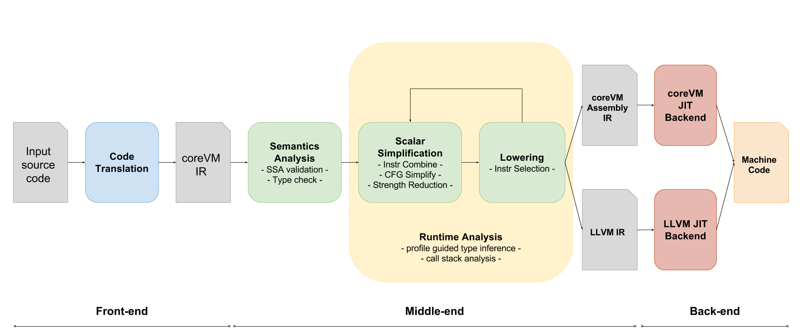

.. Copyright Yanzheng Li. All rights reserved.

Just-in-Time Compilation Pipeline
=================================

coreVM's just-in-time compilation pipeline provides optimization opportunities
that can translate high-level language code into native machine code to speed
up execution. The JIT pipeline consists of multiple phases of operations and
it makes use of a set of techniques to achieve just-in-time compilation.

The first step involves translating the original input source code into an
abstract language representation, referred as the
`coreVM Intermediate Representation <reference.html#corevm-intermediate-representation>`_,
for further processing. This representation is capable of capturing most
high-level language constructs and is the gateway to the rest of the JIT
pipeline. The translation to this representation can occur at different
granularities, such as whole-module or per-function translations, depending on
the specifics of the language as well as the needs of the language runtime.

Next are the middle-end phases of the pipeline, which has three major
responsibilities. One is to primarily focus on validating and optimizing the
translated IR code by processing the IR input into a series of optimization
pass. The passes generate intermediate data that are used for further
optimizations and can be extended to be used for passes implemented in the
future. Several of the passes encompass the following optimization techniques:

  * SSA fix-up.
  * Strength reduction - CFG simplification, constant folding, common subexpression elimination, etc.
  * Tail duplication.

The next major responsibility of the middle-end phases is to resolve all the
remaining high-level language constructs and dynamic types by making use of
a set of runtime analysis techniques, such as profile-guided type inference,
call-stack analysis, etc. These phases run in a feedback loop in cooperation
with the core runtime until all the resolutions are complete.

The last step in the middle-end phase is a set of lowering processes that
translate IR code into a lower-level representation. The choice of the target
representation depends on the specific JIT backend used. Currently two backends
have been proposed to be incorporated into the pipeline: one is to make use of
the LLVM's JIT facilities, in which case the target representation is the LLVM
Intermediate Representation. The other one is a native JIT backend in coreVM
that is currently in development, and the corresponding target representation
is the *coreVM Assembly Intermediate Representation*.

The output of the JIT pipeline is the equivalent machine code of the original
input. Finally, coreVM uses on-stack replacement to bootstrap and
execute the compiled native code.

The diagram below illustrates coreVM's just-in-time compilation pipeline.

