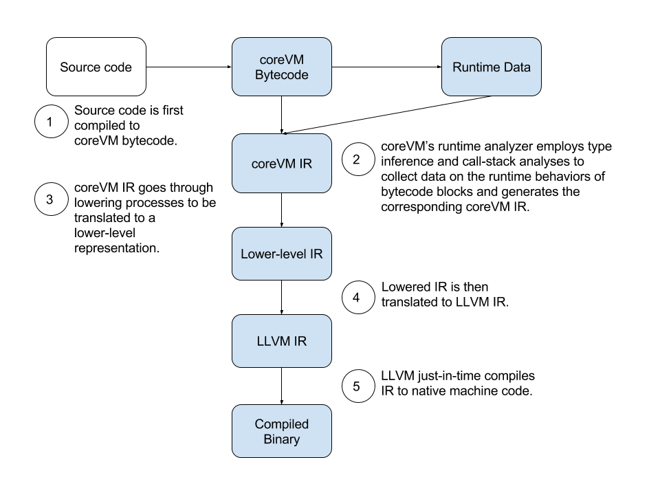

.. Copyright Yanzheng Li. All rights reserved.

Just-in-Time Compilation
========================

coreVM makes use of a set of techniques to achieve just-in-time compilation.
The first step is to use a runtime analyzer to profile bytecode execution in
order to determine the necessary code blocks or parts of the code blocks that
have the need to be just-in-time compiled with the appropriate runtime
tradeoffs. The second step following that is to sample the runtime behavior of
the identified blocks and infer the types of the objects referred throughout the
identified code paths.

Once the runtime analyses are complete, coreVM uses the data gathered to
generate the coreVM intermediate representation of the code blocks that are to
be compiled. Next, an IR translator translates the coreVM IR into the LLVM
equivalents.

Next, coreVM makes use of the JIT API provided by LLVM to compile the IR into
native machine code. And finally, it uses on-stack replacement to bootstrap and
execute the compiled native code.

The diagram below illustrates coreVM's just-in-time compilation pipeline.

